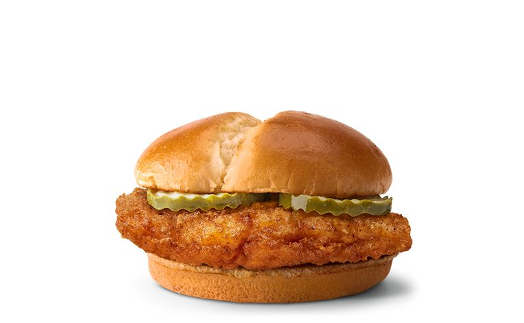

<kbd> alt + f4 </kbd>

# The Best (TOP 5) Chicken Sandwiches Ranked!!!

Today, I will be ranking the top 5 best fast food
chicken sandwiches. This is essential to know, as when 
choosing a certain location it may be difficult to ascertain
the correct choice of sandwich.

## Number 5. School Sandwich
The school sandwich is known by many a student. Especially
being a 2000's kid you would know the tastyness of this 
abomination is not suitable for human consumption.

  

## Number 4. Mcdonalds Sandwich
The Crispy Chicken Sandwich comes in three variants: classic, spicy and deluxe. 
Each starts with an all-white-meat chicken fillet topped with crinkle-cut pickles 
and served on a toasted, buttered potato roll. The spicy version adds spicy pepper 
sauce to the mix while ordering the deluxe gets you shredded 
lettuce, Roma tomatoes and mayo.
In short, this thing is mid!

  

  
## Number 3. Chick-Fil-A Sandwich
A boneless breast of chicken seasoned with a spicy blend of peppers, 
hand-breaded, pressure cooked in 100% refined peanut oil and served on a 
toasted, buttered bun with dill pickle chips.
This thing is good, but slightly on the costly side. A solid 3/5.

  

  
## Number 2. KFC Sandwich
KFC’s chicken breast—with its inferior breading and relative lack of 
crunch—is what holds this sandwich back.

  

  
## Number 1. Popeyes Sandwich
Off the bat, Popeyes’ chicken appeared to have a more golden-brown 
breading and a crunchier texture. Popeyes' chicken still pulled ahead.
Like Lebron James in the 4th quarter, this thing is the GOAT!

  

